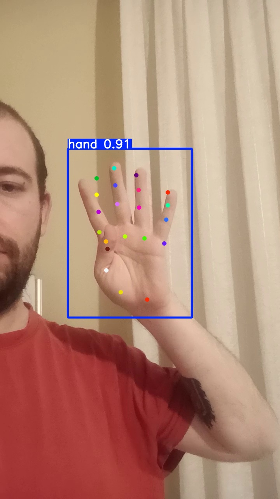
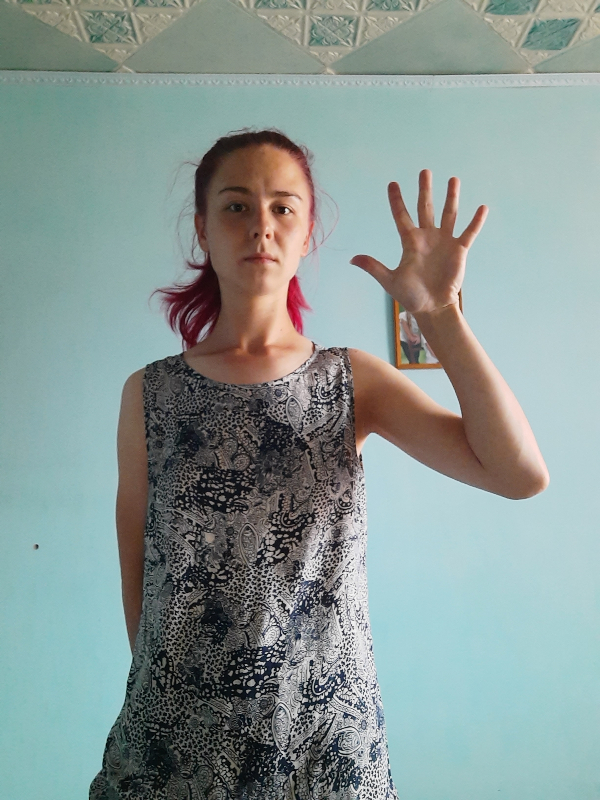
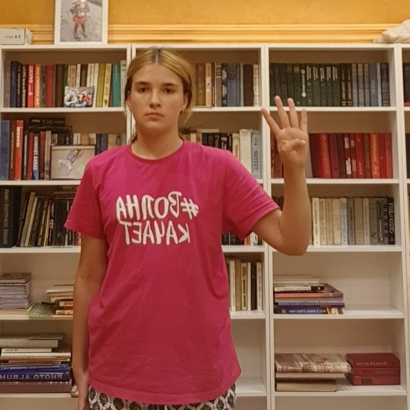
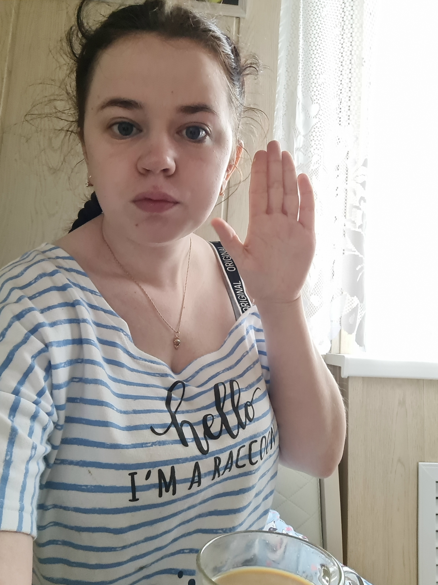
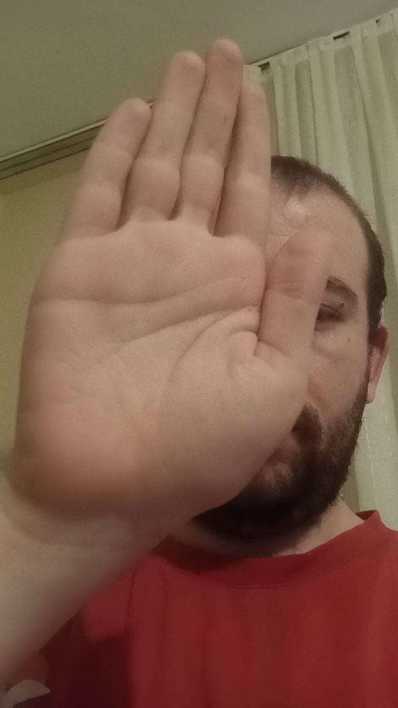
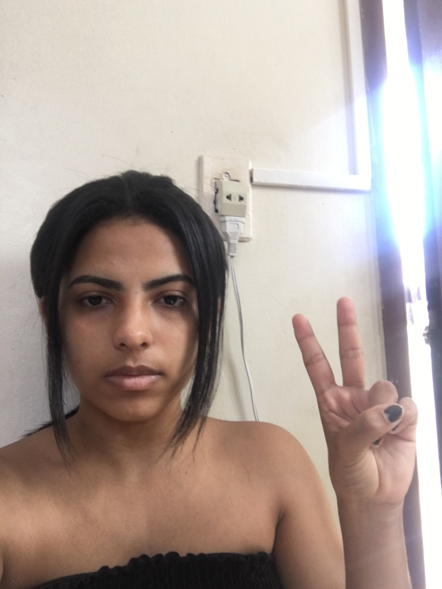
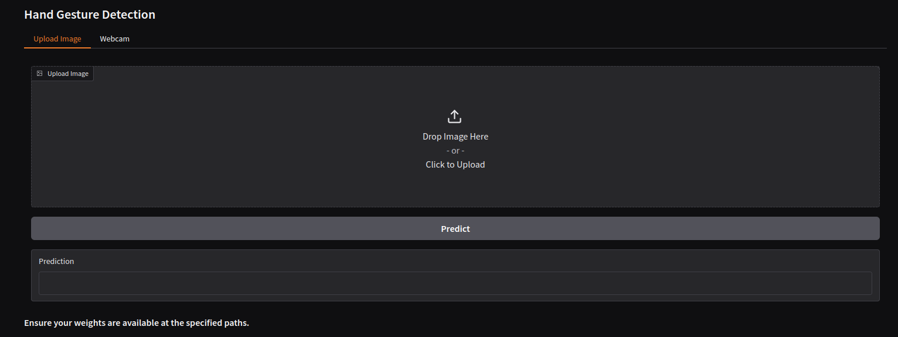
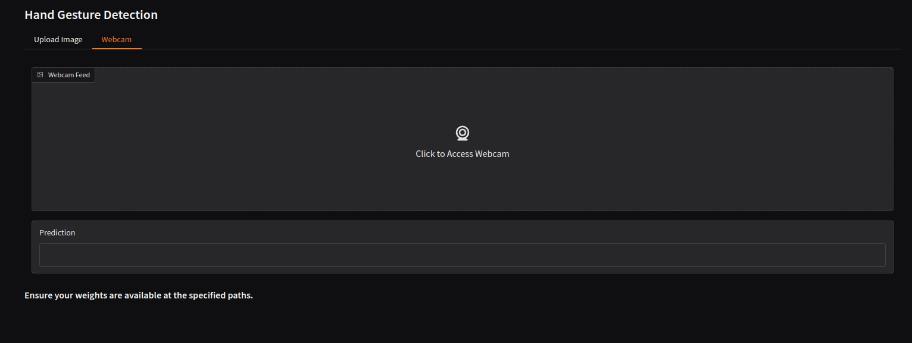

# Vision-Based Hand Gesture Detector

The objective of this project is to develop a deep learning–based hand gesture detector. Initially, hand keypoints are detected using YOLOv11, and subsequently, these keypoints are utilized to recognize hand gestures.

## Installation

To install the required dependencies, run the following command:

```bash
python -m venv venv
source venv/bin/activate  # On Windows, use `.\venv\Scripts\activate`
pip install -r requirements.txt
```

The project requires Python 3.12 and tested on Ubuntu 24.04 and Windows 10.

## Dataset

The dataset comprises two components:
1. A subset of the [HaGRID](https://github.com/hukenovs/hagrid) dataset
2. A self-collected dataset

There are four classes:
1. four
2. five
3. stop
4. none

For the HaGRID dataset, the "four", "palm", and "stop" categories are employed, with the "palm" class being relabeled as "four". Additionally, the "call", "piece", and "rock" classes correspond to the "none" label.

The self-collected dataset includes images for all defined classes. In the case of the "none" class, various gestures such as "fist" and "peace" are incorporated.

### Pre-processing

During pre-processing, hand keypoints are detected using YOLOv11. Images that do not yield detected keypoints are omitted from the dataset. After keypoint extraction, the relative distances from the top-left corner of the hand bounding box are computed and normalized based on the bounding box's width and height. These normalized distances serve as input for the hand gesture recognition process. This process yields 42 features (derived from 21 keypoints with x and y coordinates). An example keypoint detection is shown below:



### Dataset Structure

Dataset is structured as follows:

```
data/
├── four/
│   ├── frames/
│   │   ├── image1.jpg
│   │   ├── image2.jpg
│   │   └── ...
│   └── bbox_keypoints.json
├── five/
│   ├── frames/
│   │   ├── image1.jpg
│   │   ├── image2.jpg
│   │   └── ...
│   └── bbox_keypoints.json
├── stop/
│   ├── frames/
│   │   ├── image1.jpg
│   │   ├── image2.jpg
│   │   └── ...
│   └── bbox_keypoints.json
└── none/
    ├── frames/
    │   ├── image1.jpg
    │   ├── image2.jpg
    │   └── ...
    └── bbox_keypoints.json
```

"frames" folders are keeping the images corresponding to the parental folder name. "bbox_keypoints.json" holds the predicted keypoints to be used in the training phase. In order to train the model, the dataset should be structured as shown above.

### Exploratory Dataset Analysis

The number of images per class is as follows:
- stop: 218
- four: 212
- five: 209
- none: 229

Thus, the dataset is well-balanced.

#### Examples of Class "five"




#### Examples of Class "four"




#### Examples of Class "stop"




#### Examples of Class "none"




## Model Selection and Training

### Model Architecture

YOLOv11 is employed to detect hand keypoints. For gesture recognition, a custom model is trained using AutoGluon.

YOLOv11 is taken from the [YOLOv11 repository](https://github.com/chrismuntean/YOLO11n-pose-hands/tree/main). The model is trained on the [Hand Keypoint Dataset 26K](https://www.kaggle.com/datasets/riondsilva21/hand-keypoint-dataset-26k) dataset. The model sometimes fails to detect keypoints, which results in the exclusion of some images from the dataset. However, the model performs well on the majority of images.

The model leverages normalized keypoint distances as input. The training yields a Weighted Ensemble L2 model with the following ensemble weights:
- NeuralNetTorch: 0.5
- NeuralNetFastAI: 0.25
- LightGBMXT: 0.25

The model achieves an accuracy of 0.8908 on the validation set.

### Training Process

Training is orchestrated via the [train.py](train.py) script. Data is loaded from a JSON file, from which the required fields are extracted to construct a Pandas DataFrame. An 80/20 train/validation split is applied during training. The model is then trained using AutoGluon’s Tabular Predictor module on an RTX 4080 Super GPU.

No training tracking tool is employed, as the training process is relatively short and the model is not expected to be retrained frequently. The average training time is approximately 30 seconds. The model achieves an accuracy of 0.8908 on the validation set.

To train the model, run the following command:

```bash
python train.py --model-path <path_to_autogluon_model> --data-root <path_to_data>
```

Here, `<path_to_autogluon_model>` is the directory where the trained model will be saved, and `<path_to_data>` is the root directory of the dataset.

However, you can also use the default model path and data root as follows:

```bash
python train.py
```

### Evaluation

The model is evaluated using the [evaluate.py](evaluate.py) script. The script loads the model and the evaluation dataset, and subsequently computes the model's performance metrics. The evaluation report is presented in the following section.

To evaluate the model, run the following command:

```bash
python validate.py --model-path <path_to_autogluon_model> --data-root <path_to_data>
```

Here, `<path_to_autogluon_model>` is the directory where the trained model is saved, and `<path_to_data>` is the root directory of the dataset.

However, you can also use the default model path and data root as follows:

```bash
python validate.py
```

### Evaluation Report

The following tables summarize the model's performance metrics.

#### Overall Metrics

| Metric              | Value  |
| ------------------- | ------ |
| Validation Accuracy | 0.8908 |
| Macro Precision     | 0.8953 |
| Macro Recall        | 0.8911 |

These metrics demonstrate strong model performance with approximately 89% accuracy across all predictions. The high and balanced macro precision and recall scores (both around 0.89) indicate consistent performance across all classes without significant bias toward any particular class.

#### Confusion Matrix

```
[[37  2  2  1]
 [ 0 38  3  1]
 [ 0  2 40  4]
 [ 1  0  3 40]]
```

Reading the confusion matrix row by row:
- Row 1: Of 42 "five" gestures, 37 were correctly identified, with minimal misclassifications
- Row 2: Of 42 "four" gestures, 38 were correct, with slight confusion with "none" (3 cases)
- Row 3: Of 46 "none" gestures, 40 were correct, with some confusion with "stop" (4 cases)
- Row 4: Of 44 "stop" gestures, 40 were correct, with minor confusion with "none" (3 cases)

#### Classification Report

| Class | Precision | Recall | F1-score | Support |
| ----- | --------- | ------ | -------- | ------- |
| five  | 0.97      | 0.88   | 0.93     | 42      |
| four  | 0.90      | 0.90   | 0.90     | 42      |
| none  | 0.83      | 0.87   | 0.85     | 46      |
| stop  | 0.87      | 0.91   | 0.89     | 44      |

| Average Type     | Precision | Recall | F1-score | Support |
| ---------------- | --------- | ------ | -------- | ------- |
| Accuracy         | -         | -      | 0.89     | 174     |
| Macro Average    | 0.90      | 0.89   | 0.89     | 174     |
| Weighted Average | 0.89      | 0.89   | 0.89     | 174     |

The macro and weighted averages around 0.89 confirm consistent performance across all classes, with minimal impact from class imbalances.

### Challenges

The primary challenge encountered during model training was the limited number of images available for training. Dataset sizes are either too big or too small, with no intermediate sizes available for this case. This issue was mitigated by mixing the HaGRID dataset with a self-collected dataset.

There was no class-imbalance issue, as the dataset is well-balanced. However, the model sometimes fails to detect keypoints, resulting in the exclusion of some images from the dataset. This issue could be addressed by employing a more robust keypoint detection model.

## Inference

The project provides two methods for inference: a command-line script and a GUI application.

### Command-line Inference (predict_image.py)

The `predict_image.py` script provides a straightforward way to perform gesture recognition on a single image. It combines YOLOv11 for keypoint detection and the trained AutoGluon model for gesture classification.

Usage:
```bash
python predict_image.py --image <path_to_image> --yolo-model <path_to_yolo_model> --autogluon-model <path_to_autogluon_model>
```

The script follows these steps:
1. Loads the input image using OpenCV
2. Initializes the YOLOv11 model for keypoint detection
3. Detects hand keypoints in the image
4. Converts the keypoints into normalized features
5. Uses the AutoGluon model to predict the gesture class
6. Outputs the predicted gesture class

If no keypoints are detected in the image, the script will display an error message.

### GUI Application (gui.py)

The project includes a user-friendly graphical interface built with Gradio that offers two modes of interaction:

1. **Image Upload**: Users can upload images for gesture recognition
2. **Webcam Feed**: Real-time gesture recognition from webcam input

Usage:
```bash
python gui.py
```

The GUI application automatically loads the models from these default locations:
- YOLOv11 model: `./weights/yolo-best.pt`
- AutoGluon model: `./weights/autogluon_model`

Features:
- Clean, tabbed interface for switching between upload and webcam modes
- Real-time prediction with webcam feed (updates every 3 seconds)
- Error handling for invalid inputs or failed detections
- Shareable interface (can be accessed via network)




The GUI provides instant feedback with the predicted gesture class or error messages if detection fails. For webcam mode, predictions are continuously updated while maintaining reasonable performance.

#### GUI Application Demo

A demo of the GUI application is available below. .

## Performance Considerations

The project's performance can be improved by exporting the AutoGluon model to a more efficient format, such as ONNX, and optimizing the YOLOv11 model for inference. Additionally, the keypoint detection model could be replaced with a more robust model to improve detection accuracy. ONNX models can be deployed to edge devices like the NVIDIA Jetson products or Raspberry Pi for real-time gesture recognition since they are optimized for low-latency inference and require minimal computational resources. However, the current implementation is suitable for desktop or cloud-based inference.

## Possible Future Improvements

The project can be further enhanced in several ways:
- **Data Augmentation**: Apply data augmentation techniques to increase the dataset size and improve model generalization.
- **Gesture Synthesis**: Generate synthetic gesture data to augment the dataset and improve model performance.
- **Model Tuning**: Fine-tune the AutoGluon model hyperparameters to improve performance.
- **Hand Detection**: Incorporate hand detection to improve keypoint detection accuracy.
- **Better Keypoint Detection**: Replace YOLOv11 with a more accurate keypoint detection model to reduce the number of excluded images.
- **Gesture Expansion**: Add more gesture classes to the dataset to increase the model's versatility.
- **Real-time Tracking**: Implement real-time hand gesture tracking for continuous gesture recognition.
- **Mobile Deployment**: Optimize the models for mobile deployment to enable gesture recognition on smartphones or tablets.
- **Multi-Person Detection**: Extend the model to detect gestures from multiple people in the frame.
- **Gesture Segmentation**: Implement gesture segmentation to detect the start and end of gestures for more precise recognition.
